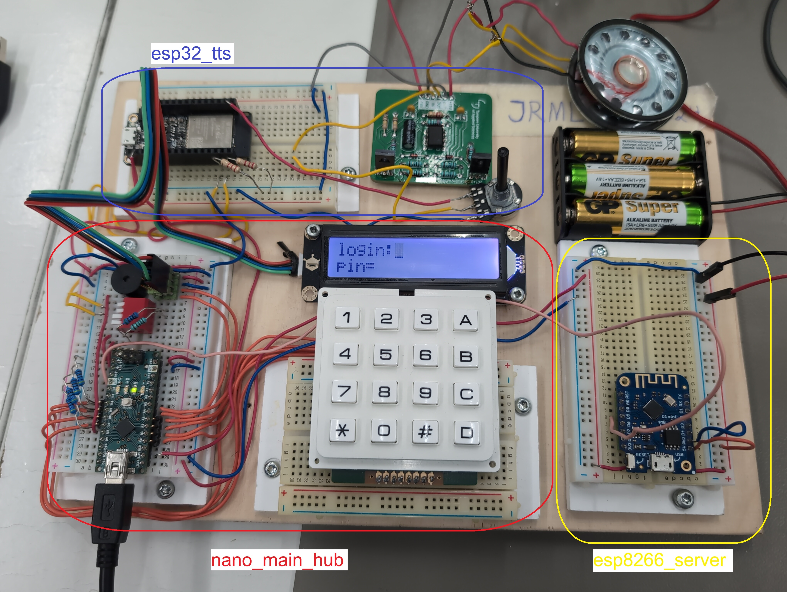
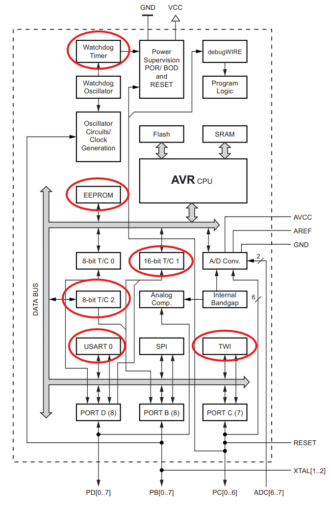
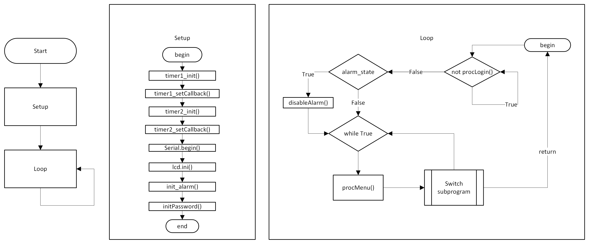

# Software Directory

Each directory in this folder represent a programmable device. 
`nano_main_hub` is the main control unit. All other devices are used as peripheral devices to the main hub.

`nano_main_hub` uses the following features of the `atmega328p` microcontroller for its control logic.

The software composition of `nano_main_hub` is achieved through 3 main layers. 
- Hardware library files (`src/`)
- Application sub processes (`procThing`)
- Main loop (`main.ino`)

The following flow diagram illustrates the main logic of `nano_main_hub`.

## Devices

### Main hub ([link](nano_main_hub/))

Has a D1 mini for wifi connection to alarm units and an Arduino to process incoming alarms via hardware interrupts. Hosts the user interface.

### Text-to-speech ([link](esp32_tts/))

ESP32 gets string data via serial connection from Arduino Nano, the characters are stored in a fifo buffer which are synthesised into speech after a carriage return character has been read.

### Alarm sensor ([link](esp8266_window_sensor/))

Made using a D1 Mini. Uses an IMU and a magnet sensor to detect door or window opening or shaking.

### Wifi server ([link](esp8266_server/))

D1 Mini runs a wifi server and relays any alarms received via wifi to Arduino Nano by wire.

